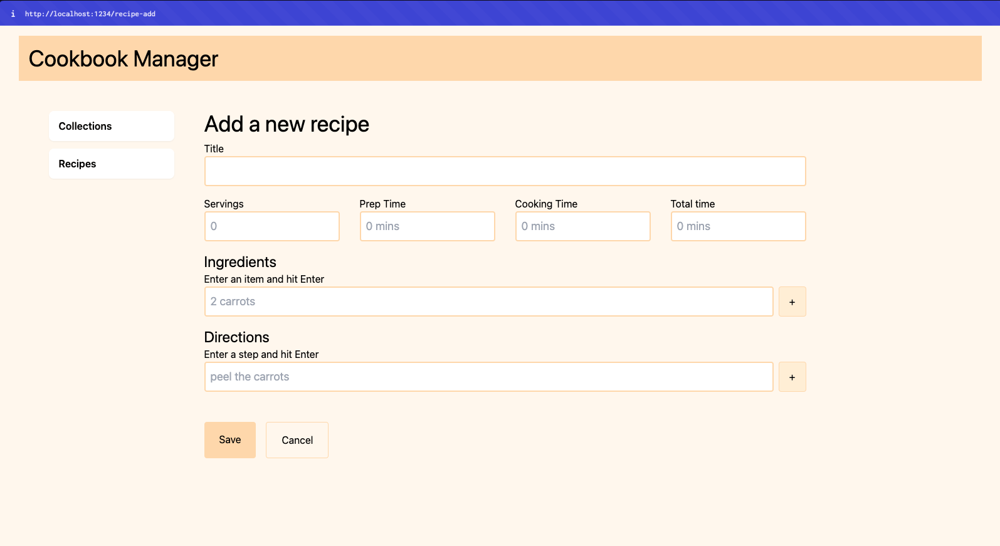
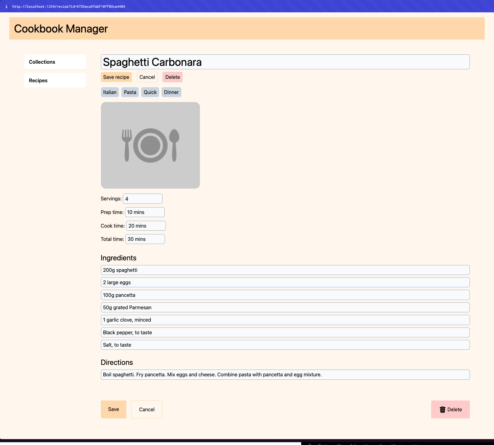

# TTC2080 Fullstack Project: Cookbook

A recipe book manager that lets you oraganize and store recipes.

- [Setup](./docs/setup.md)
- [Lessons learned](./docs/lessons-learned.md)
- [Screenshots](./screenshots/)
- [Time costs](#time-costs)






```bash
# Frontend
cd frontend
npm install && npm run dev
```

```bash
# Backend
cd backend
npm install && npm run dev
```

## Implemented Functionality

- Collections (Recipe collection, based on a food category, e.g. Desserts)
  - View all recipes for that collection
  - Create a recipe for a collection
  - Create/Edit/View/Delete collection

- Recipes 
  - List all recipes
  - List a single recipe with all details
  - Create/Edit/View/Delete recipe
  - Meta info (cooking time, servings etc.)
  - Found all recipes by a particular _tag_ name

## Planned functionality
- Search and filtering for recipes and collections
  - Find recipes based on name, tag, collection
  - Find collections based on name
- Authentication and multi-user capacity
- Uploading of images

## Stack
- Frontend: Plain old HTML, CSS and JavaScript
- API: REST API powered by Express

## Time costs

- Deciding the stack and implementation structure: 5 hours
- Research: 5 hours
- Designing the API: 2 hours
- Coding the API: 10 hours
- Designing the frontend: 5 hours
- Coding the frontend:  15 hours
- Troubleshooting and bug fixing: 15 hours
- Documentation: 5 hours

Total time spent: 62 hours


