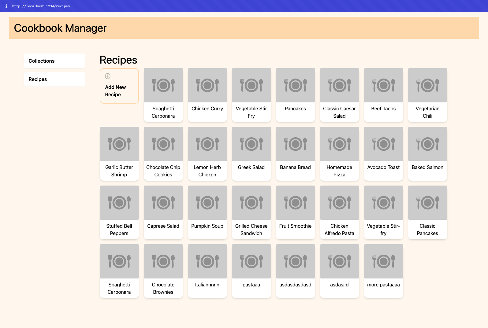

# TTC2080 Fullstack Project: Cookbook

A recipe book manager that lets you oraganize and store recipes.

- [Video DEMO](https://www.youtube.com/watch?v=UAPIm0-T270)
- [Setup](./docs/setup.md)
- [Lessons learned](./docs/lessons-learned.md)
- [All Screenshots](./screenshots/)
- [Time costs](#time-costs)

More than 8 custom views have been added. Some are




```bash
# Frontend
cd frontend
npm install && npm run dev

# https://localhost:1234
```

```bash
# Backend
cd backend
npm install && npm run dev

# https://localhost:3000
```

## Implemented Functionality

- Collections (Recipe collection, based on a food category, e.g. Desserts)

  - View all recipes for that collection
  - Create a recipe for a collection
  - Create/Edit/View/Delete collection

- Recipes
  - List all recipes
  - List a single recipe with all details
  - Create/Edit/View/Delete recipe
  - Meta info (cooking time, servings etc.)
  - Found all recipes by a particular _tag_ name

## Planned functionality

- Search and filtering for recipes and collections
  - Find recipes based on name, tag, collection
  - Find collections based on name
- Authentication and multi-user capacity
- Uploading of images
- Implement more endpoints

## Stack

- Frontend: Plain old HTML, CSS and JavaScript
- API: REST API powered by Express

## Time costs

- Deciding the stack and implementation structure: 5 hours
- Research: 5 hours
- Designing the API: 2 hours
- Coding the API: 10 hours
- Designing the frontend: 5 hours
- Coding the frontend: 15 hours
- Troubleshooting and bug fixing: 15 hours
- Documentation: 5 hours

Total time spent: 62 hours

## Backend API endpoints

| Method | Endpoint                     | Description                                      |
| ------ | ---------------------------- | ------------------------------------------------ |
| GET    | /                            | Returns a list of all endpoints that can be used |
| GET    | /recipes                     | Returns a list of all recipes                    |
| GET    | /recipes?name=""             | Get a recipe by name                             |
| GET    | /recipes?cookbookId=""       | Get a recipe by cookbook ID                      |
| GET    | /recipes?name=""&cookbook="" | Get a recipe by name and cookbook ID             |
| POST   | /recipes                     | Create a recipe                                  |
| PUT    | /recipes/{id}                | Update a recipe by ID                            |
| GET    | /recipes/{id}                | Return a single recipe by ID                     |
| DELETE | /recipes/{id}                | Delete a recipe by ID                            |
| GET    | /cookbooks                   | Returns a list of all cookbooks                  |
| POST   | /cookbooks                   | Create a cookbook                                |
| GET    | /cookbooks/{id}              | Return a single cookbook by ID                   |
| DELETE | /cookbooks/{id}              | Delete a cookbook by ID                          |
| GET    | /tags?name=""                | Return all recipes with a particular tag         |
