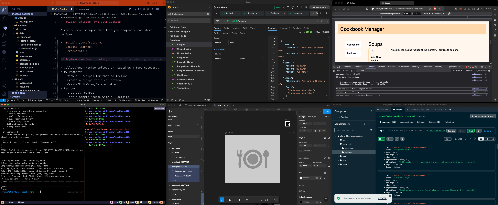

## Frontend

```bash
npx parcel 'frontend/*' # start parcel

# -OR-
npm run dev
```

## Backend

```bash
npm run dev # start express
```

- `.env` was used for keeping database credentials secure
- [Express](https://expressjs.com/)
- [Bruno](https://www.usebruno.com/) for API testing
- [MongoDB Compass](https://www.mongodb.com/products/tools/compass) for checking database values

## Decisions
The following decisions have been made after trial and error. They were made in pursuit of reducing complexity and reducing time to production

- Keep Express only for backend API, do not try to serve your HTML/static files with it
- Drop TypeScript from backend to avoid hassles with CommonJS
- Drop Vite because of inability to render more than one HTML file or entire directories of HTML pages


## Notes
- Not using [Vite](https://vite.dev/) anymore because it only outputs one `index.html` file and added unnecessary complexity
- Not using [Tailwind v4 beta](https://tailwindcss.com/docs/v4-beta) anymore because it needed Vite or extra build tools.
  - Using a CSS file from [PlayCDN now](https://tailwindcss.com/docs/installation/play-cdn)
- Keeping TypeScript because i like it
- Using [Parcel](https://parceljs.org/) to compile TS